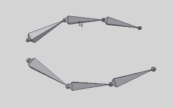

### (Armature) Make Stretcher

2つのボーンの間を `Stretch To` コンストレイントで繋ぐボーンを生成します。

---

使い方：
* ポーズモードにて2つのボーンを選択してから実行。  
  両者のヘッドを繋ぐボーンが生成されます。
  
  新たに生成されたボーンには `Copy Location` 及び `Stretch To` コンストレイントが設定されており、それぞれ  
  最初に選択したボーン、次に選択したボーンのヘッドがターゲットに設定されます。

 

注意点：
* ヘッドでなくテールをターゲットとしたい場合は各コンストレイントの `Head/Tail` の値を変えた後、  
  Edit Bone モードにてボーンの位置を正しい場所に配置しなおす必要があります。
* Stretch To コンストレイントの `Rest Length` の値は場合によっては手動で調整する必要があります。

---

関連：
* [blender-scripts/(Armature) Chain to SplineIK](https://github.com/a-nakanosora/blender-scripts/tree/master/(Armature)%20Chain%20to%20SplineIK)

 

