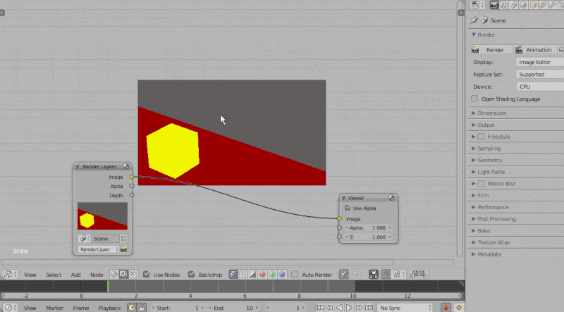

## Composite scripts

> ##### Setup Output Cache.py

Compositing Node Editor を開いている状態で実行。`File Output`ノードと、その出力先と同パスを示す`Image Sequence`ノードを作成します。

初回実行時は生成された Image Sequence ノードは存在しないパスを参照している状態にありますが、 File Output ノードによる出力が行われた後ではきちんと実体を参照する形になります.

