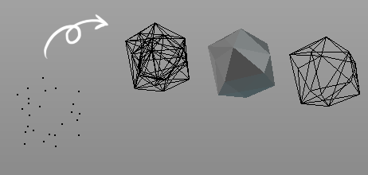

### Delaunay from point cloud

---

メッシュの頂点群に対して3Dドロネー分割を行います。

---

> usage:

* メッシュオブジェクトをアクティブにした状態でスクリプトを実行。  
  そのメッシュの頂点群を入力として3Dドロネー分割を行い、結果としてそのエッジと表層フェースをメッシュにして出力します。

---

スクリプト作成にあたり、下記のページを参考にさせていただきました：

> 3D Delaunay Triangulation- OpenProcessing  
> http://www.openprocessing.org/sketch/31295

> Unity で ドロネー Delaunay 分割 （3D編） - 自習室  
> http://izmiz.hateblo.jp/entry/2014/09/02/205700

