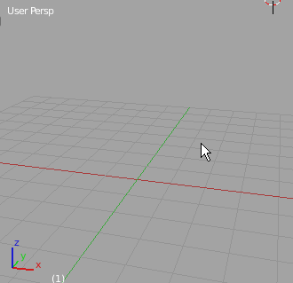

## GreasePencil

> ##### Symmetrize Strokes.py

アクティブな`Grease Pencil Layer`のストロークをX軸方向(`+X`から`-X`方向)に反転コピーします。

スクリプト実行の際、いくつかの条件で反転の軸となる座標系を選択することができます：

* もしGP Layerに`Parent`が設定されてあれば、そのオブジェクトのローカル座標上でのX軸

   

* 選択オブジェクトがあればそのオブジェクトのローカル座標

   

* 上記に該当しない場合はグローバル空間でのX軸方向

   
