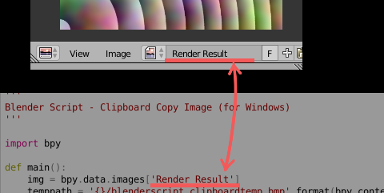

## Image scripts

> ##### Clipboard Copy Image (Windows).py

(Windows7 64bitでのみ動作確認)  
指定した`Image`スロットの画像をクリップボードにコピーします。

デフォルトでは`Render Result`スロットの画像が対象となっています。スクリプト中の対応する箇所(`bpy.data.images['<この部分>']`)を書き換えることで対象の画像スロットを変更できます。

---

> ##### Clipboard Copy Image [Viewer Node] (Windows).py

上のスクリプトの`Viewer Node`が対象のバージョン。

---

> ##### Clone Viewer Node Image.py

イメージスロット`Viewer Node`の画像のコピーを行うためのスクリプト。
`Viewer Node`の画像はBlender標準の方法だと正しくコピーできないので、それを回避するためのものとなっています。

---

> ##### Petit Thinning.py

画像にモルフォロジーフィルタをベースとした簡易的な細線化処理を行います。  
**<!>** 使用には外部ライブラリである **Pillow(PIL)** のインストールが必要です

スクリプトを実行すると画像スロット`A`にある画像に処理を施し、結果をスロット`B`に保存します。

`class Pref` 中の `emptyrange`, `emptythres`, `dilation_max_depth` がパラメータとなっており、これらの値を調節することでフィルタの利き具合を変化させることができます。

* `emptyrange` -- 1以上の整数
* `emptrythres` -- 0.0～1.0の範囲。1.0に近づけるほど細線化の効果が強くなりますが、線は途切れがちになります。
* `dilation_max_depth` -- 1以上の整数。大きい数値を指定することでより太い線の細線化に対応できますが、太すぎる線の場合ノイズが発生しがちになります。

基本的に`emptyrange`は`dilation_max_depth`より大きい値にするとノイズが低減します。

---

> ##### Petit Thinning CLI/petit_thinning.py

`Petit Thinning.py`のCLIバージョンです。BlenderでないPython上で使用できます。  
使用にはPython環境上に**Pillow(PIL)**を導入している必要があります。

